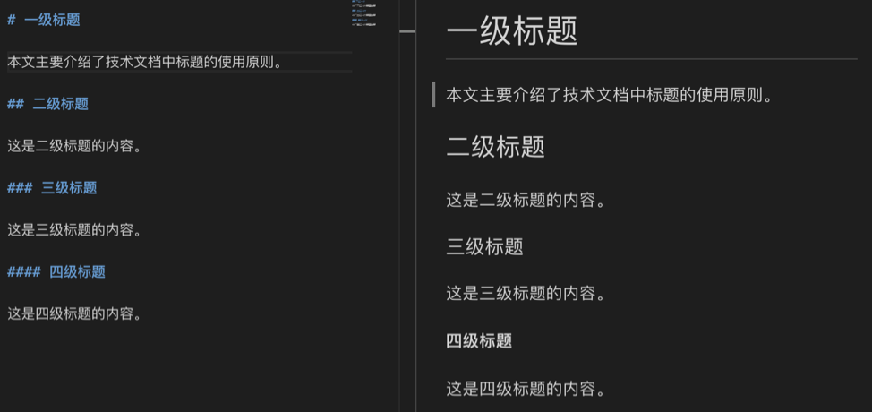

## 标题

标题在技术文档中的地位非常重要，文档工程师要设计合理的标题层级和标题描述，帮助读者理清整篇文档的逻辑，使文章结构一目了然。

### 标题的层级

技术文档中使用标题最多不超过四级。标题从一级开始递增使用，禁止跳级使用。例如：一级标题下面不能直接使用三级标题；二级标题下面不能直接使用四级标题。

- 一级标题：文章标题

- 二级标题：文章正文部分的标题

- 三级标题：二级标题下面一级的小标题

- 四级标题：三级标题下面某一方面的小标题

下图为在 Markdown 技术文档中使用标题的示例，左侧是编辑文字，右侧是预览效果：

为避免出现过于复杂的章节，若无特殊需要，不建议使用四级标题。如果三级标题下有并列性的内容，建议使用列表 (list) 代替四级标题。如下图中，若内容 A、B、C 的篇幅不长，则右侧的标题样式比左侧的标题样式要好。

### 标题的描述

技术文档中的标题包括但不限于以下几种描述：

- 名词词组，如“概述”、“背景”、“原理”

- 主题词+动词，如“A 工具安装”、“A 工具部署”、“A 工具配置”

- 动词+主题词，如“配置 MySQL 数据库”

- 定语+主题词，如“A 工具的安装”，“A 工具的架构” 

- 介词+定语+主题词，如“对机器配置的要求”

标题描述的设计并无严格的模板，只要遵循以下几个原则即可：

- 标题能够概括反映本章节的中心内容

- 标题应该简洁扼要、涵义明确

- 同级别的标题应尽量使用相同的结构

- 标题描述操作任务时建议使用“动词+主题词”结构，不建议使用名词词组

### 使用标题的注意事项

技术文档中使用标题主要有以下几个注意事项：

- 下级标题禁止重复上一级标题的内容

- 不建议标题以标点符号（如句号或问号）结尾

- 不建议在标题中解释缩略语

- 标题与标题之间应该有引导介绍性的句子。例如，一级标题和二级标题之间应有引言，二级标题和三级标题之间应有正文内容

- 标题要避免孤立编号（即同级标题只有一个），正文不要有孤立的三级标题和四级标题

- 项目列表是最小编号单位，因此项目列表下禁止嵌套任何级别的标题
